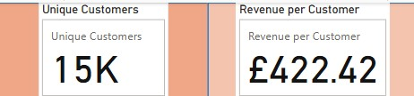

# data-analytics-power-bi-report377
## Milestone 5 - Build the Customer Detail page.
### - Task 1: Create Headline Card Visuals
Used this DAX formula to create the [Revenue per Customer] measure:

    Revenue per Customer = DIVIDE([Total Revenue], [Total Customers], 0)

Then incorporated it into card visuals, as per task instructions:  
(For visual purposes, Revenue per Customer format changed to 2 decimal places and assumed to be in Sterling)

### - Task 2: Create the Summary Charts
Two Donut Charts created, as instructed (colours left as default):

### - Task 3: Create the Line Chart
Line Chart created as per instructions, with settings for trend line and forecast.

### - Task 4: Create the Top 20 Customers Table
Table created, as instructed:
(Note - values with blank names excluded as seen in the filter screenshot)

With these settings:

  

### - Task 5: Create the Top Customers Cards
Cards created as instructed, with settings similar to task 3:
(Headings renamed to reflect presentational context)

### - Task 6: Add a Date Slicer
Slicer added as instructed:

### - Finished Page

